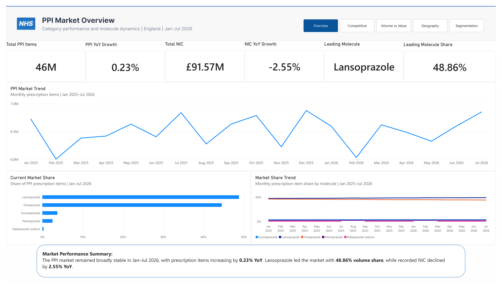
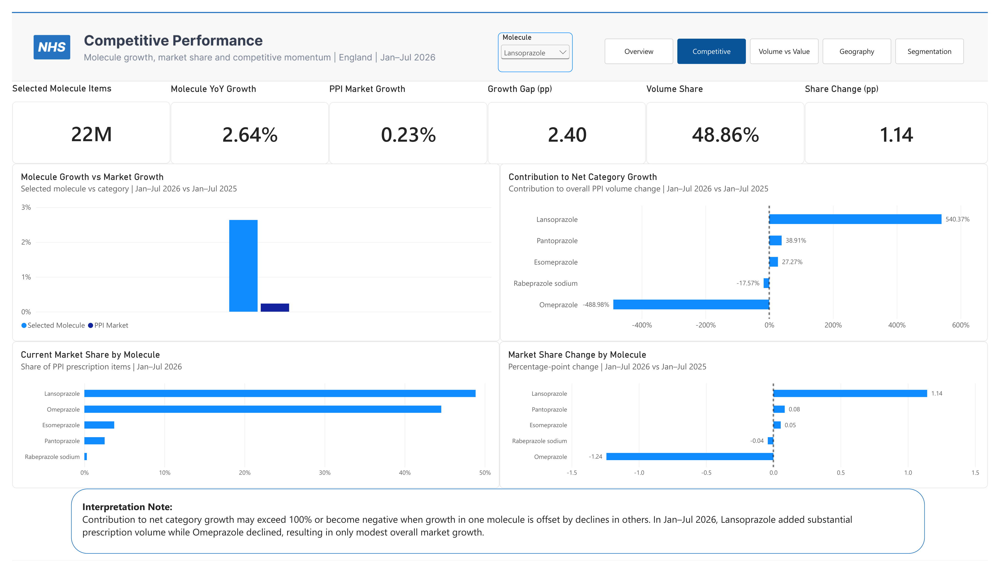
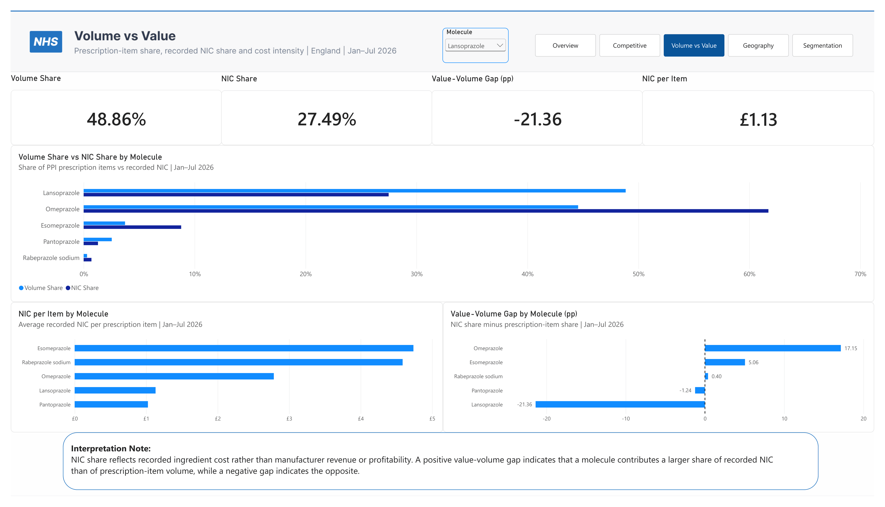
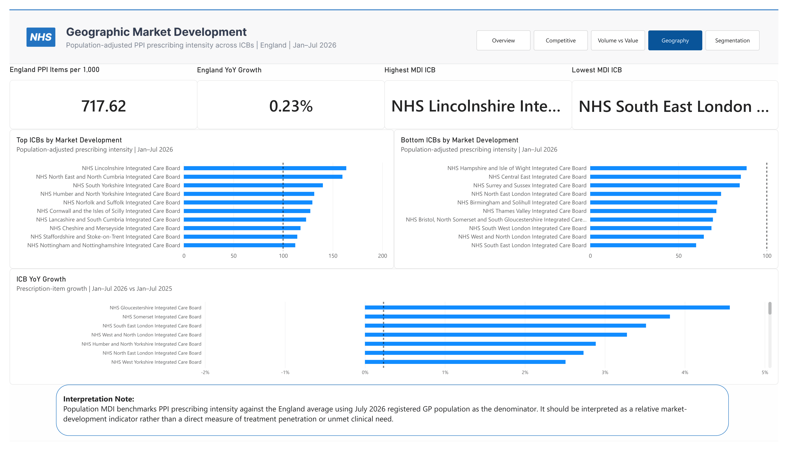
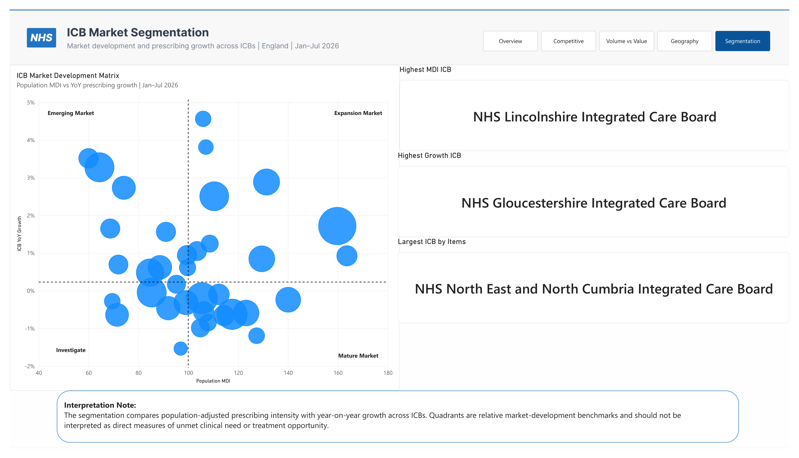

# PPI Market Commercial Analytics

A Power BI pharmaceutical commercial analytics project evaluating the English Proton Pump Inhibitor (PPI) market across category growth, molecule competition, recorded Net Ingredient Cost dynamics, population-adjusted prescribing intensity, and ICB-level market development.

The project uses publicly available NHS prescribing and GP population data to answer five core commercial questions:

1. How is the PPI market performing overall?
2. Which molecules are gaining or losing competitive position?
3. How does prescription-volume share differ from recorded NIC share?
4. How does prescribing intensity vary across ICBs after adjusting for registered population?
5. Which ICBs show different combinations of market development and prescribing growth?

---

# Project Overview

The project analyses five major PPI molecules:

- Omeprazole
- Lansoprazole
- Esomeprazole
- Pantoprazole
- Rabeprazole

The analytical period covers:

> **January 2025 – July 2026**

The primary headline comparison is:

> **January–July 2026 vs January–July 2025**

The project combines:

- NHS prescribing data
- July 2026 registered GP population
- July 2026 GP practice-to-ICB mapping

This enables both national commercial analysis and population-adjusted ICB benchmarking.

---

# Business Question

> **How is the PPI prescribing market evolving across England, which molecules are gaining or losing competitive share, and how does prescribing intensity vary across ICBs?**

Supporting questions include:

- How large is the PPI market?
- Is the category growing or declining?
- Which molecule holds the largest prescription-item share?
- Which molecules are gaining or losing share?
- Which molecules contribute most to net category growth?
- How does recorded NIC differ from prescription-volume dynamics?
- Which molecules have disproportionately high or low NIC share relative to volume share?
- How does PPI prescribing intensity vary across ICBs?
- Which ICBs sit above or below the England benchmark?
- Which ICBs combine relatively high or low market development with stronger or weaker prescribing growth?

---

# Dashboard

The Power BI report contains five analytical pages:

1. Market Overview
2. Competitive Performance
3. Volume vs Value
4. Geographic Market Development
5. ICB Market Segmentation

---

## Page 1 — Market Overview



The first page provides an executive overview of the PPI market.

### Headline KPIs

- **Total PPI Items:** approximately 45.5M
- **PPI YoY Growth:** +0.23%
- **Total NIC:** approximately £91.6M
- **NIC YoY Growth:** -2.55%
- **Leading Molecule:** Lansoprazole
- **Leading Molecule Share:** approximately 48.86%

### Key Visuals

- PPI Market Trend
- Current Market Share
- Market Share Trend
- Market Performance Summary

### Key Insight

The PPI market remained broadly stable in Jan–Jul 2026, with prescription items increasing by approximately **0.23% YoY**.

Despite limited category growth, the competitive mix continued to shift.

Lansoprazole held approximately **48.86% of prescription-item volume**, while Omeprazole represented the second-largest molecule.

Recorded NIC declined by approximately **2.55% YoY**, indicating that recorded cost dynamics differed from prescription-volume growth.

---

## Page 2 — Competitive Performance



The second page evaluates molecule-level competitive performance.

A molecule selector enables comparison between a selected PPI and the overall PPI category.

### Selected-Molecule KPIs

- Selected Molecule Items
- Molecule YoY Growth
- PPI Market Growth
- Growth Gap
- Volume Share
- Share Change

### Lansoprazole Example

For Jan–Jul 2026:

- **Prescription Items:** approximately 22.2M
- **YoY Growth:** +2.64%
- **PPI Market Growth:** +0.23%
- **Growth Gap:** approximately +2.40 pp
- **Volume Share:** 48.86%
- **Share Change:** approximately +1.14 pp

### Key Visuals

- Molecule Growth vs Market Growth
- Current Market Share by Molecule
- Market Share Change by Molecule
- Contribution to Net Category Growth

### Key Insight

The PPI market recorded only modest overall growth, but molecule-level movements were substantially larger.

Lansoprazole added approximately **571K prescription items**, while Omeprazole declined by approximately **517K items**.

This resulted in a net market increase of only around **106K items**.

The analysis therefore demonstrates that:

> **Stable category growth can mask significant internal competitive movement.**

### Interpretation Note

Contribution to net category growth may exceed 100% or become negative when positive and negative molecule-level changes offset each other.

In Jan–Jul 2026, Lansoprazole added substantial prescription volume while Omeprazole declined, resulting in only modest overall category growth.

---

## Page 3 — Volume vs Value



The third page compares prescription-item share with recorded NIC share.

### Selected-Molecule KPIs

- Volume Share
- NIC Share
- Value-Volume Gap
- NIC per Item

### Lansoprazole Example

For Jan–Jul 2026:

- **Volume Share:** 48.86%
- **NIC Share:** 27.49%
- **Value-Volume Gap:** approximately -21.36 pp
- **NIC per Item:** approximately £1.13

### Key Visuals

- Volume Share vs NIC Share by Molecule
- NIC per Item by Molecule
- Value-Volume Gap by Molecule

### Key Insight

Prescription-volume leadership does not necessarily imply a similar share of recorded ingredient cost.

Lansoprazole represented the largest share of PPI prescription items but a much smaller share of recorded NIC.

Omeprazole showed the opposite pattern, representing a larger proportion of recorded NIC than of prescription-item volume.

Esomeprazole also represented a disproportionately larger NIC share relative to its prescribing volume.

### Interpretation Note

NIC share reflects recorded ingredient cost rather than manufacturer revenue or profitability.

A positive value-volume gap indicates that a molecule contributes a larger share of recorded NIC than of prescription-item volume, while a negative gap indicates the opposite.

---

## Page 4 — Geographic Market Development



The fourth page evaluates PPI prescribing intensity across ICBs after adjusting for registered GP population.

### Key Measures

- England PPI Items per 1,000
- England YoY Growth
- Highest MDI ICB
- Lowest MDI ICB
- ICB YoY Growth

### Core Geographic Measures

Population-adjusted prescribing intensity is calculated using:

> **PPI Items per 1,000 Registered Population**

The England benchmark is then used to construct a Market Development Index:

> **Population MDI = ICB Items per 1,000 / England Items per 1,000 × 100**

Interpretation:

- `MDI = 100` → equal to England average
- `MDI > 100` → prescribing intensity above England average
- `MDI < 100` → prescribing intensity below England average

### Key Visuals

- Top ICBs by Market Development
- Bottom ICBs by Market Development
- ICB YoY Growth vs England Benchmark

### Interpretation Note

Population MDI benchmarks PPI prescribing intensity against the England average using July 2026 registered GP population as the denominator.

It should be interpreted as a relative market-development indicator rather than a direct measure of treatment penetration, unmet clinical need, or commercial opportunity.

---

## Page 5 — ICB Market Segmentation



The fifth page combines population-adjusted prescribing intensity and prescribing growth into an ICB-level segmentation framework.

### Segmentation Framework

**X-axis**

> Population MDI

**Y-axis**

> ICB YoY Growth

**Bubble Size**

> Total PPI Prescription Items

Reference lines:

- **Population MDI = 100**
- **England YoY Growth = approximately +0.23%**

### Quadrants

```text
                         HIGH GROWTH
                              ↑

        Emerging Market       |       Expansion Market
                              |
------------------------------+------------------------------→ MDI
                              |
        Investigate           |       Mature Market
                              |
                              ↓
                          LOW GROWTH
```

### Supporting Callouts

- Highest MDI ICB
- Highest Growth ICB
- Largest ICB by Items

### Interpretation Note

The segmentation compares population-adjusted prescribing intensity with year-on-year growth across ICBs.

Quadrants are relative market-development benchmarks and should not be interpreted as direct measures of unmet clinical need, treatment penetration, or definitive commercial opportunity.

---

# Data Sources

The project uses publicly available NHS data.

## NHS Business Services Authority

**English Prescribing Dataset**

Used for:

- prescription items
- molecule identification
- presentation-level prescribing
- Net Ingredient Cost
- Actual Cost
- practice-level prescribing
- historical prescribing trends

---

## NHS England / NHS Digital

**Patients Registered at a GP Practice — July 2026**

Used for:

- registered GP population
- practice-level denominator
- July 2026 GP practice-to-ICB mapping

---

# Market Definition

The primary PPI market contains five molecules:

| Molecule | Therapy Class |
|---|---|
| Omeprazole | PPI |
| Lansoprazole | PPI |
| Esomeprazole | PPI |
| Pantoprazole | PPI |
| Rabeprazole | PPI |

The project evaluates molecule-level prescribing within this defined PPI category.

Therefore:

> **Market share refers to prescription-item share within the defined five-molecule PPI market.**

---

# Data Preparation

The data-preparation workflow was completed primarily in Power Query.

The main steps included:

1. importing monthly NHS prescribing files;
2. harmonising source schemas;
3. standardising column names;
4. converting monthly fields to proper dates;
5. ensuring correct numeric parsing for NIC and Actual Cost;
6. filtering to the five defined PPI molecules;
7. appending monthly datasets;
8. building dimension tables;
9. integrating July 2026 registered GP population;
10. rebuilding practice-to-ICB mappings;
11. validating geographic comparability;
12. building a star-schema model;
13. validating national and ICB-level commercial measures.

---

# Data Model

The final model uses a dimensional structure centred on `Fact_Prescribing`.

```text
                       Dim_Calendar
                            |
                            |
Dim_Chemical ------ Fact_Prescribing ------ Dim_Presentation
                            |
                            |
                       Dim_Practice
                            |
                            |
                         Dim_ICB
                            |
                            |
                Dim_PracticePopulation
```

Conceptually:

- `Dim_Calendar` filters time
- `Dim_Chemical` filters molecule
- `Dim_Presentation` supports presentation-level analysis
- `Dim_Practice` maps prescribing records to July 2026 ICB geography
- `Dim_ICB` provides the current ICB hierarchy
- `Dim_PracticePopulation` provides the July 2026 population denominator

---

# Core Tables

## Fact_Prescribing

Contains:

- YearMonth
- PracticeCode
- ChemicalCode
- Molecule
- PresentationCode
- PresentationName
- Items
- TotalQuantity
- NIC
- ActualCost
- SNOMEDCode

Historical ICB fields were retained only for QA and hidden from report view after the practice-to-ICB model was rebuilt.

---

## Dim_Calendar

Contains:

- YearMonth
- Year
- MonthNumber
- MonthName
- Quarter
- MonthYear
- YearMonthSort

---

## Dim_Chemical

Contains:

- ChemicalCode
- Molecule
- TherapyClass
- PPIFlag

---

## Dim_Presentation

Contains:

- PresentationCode
- PresentationName
- ChemicalCode
- Molecule
- SNOMEDCode
- Formulation
- Strength
- PresentationGroup

---

## Dim_Practice

Contains:

- PracticeCode
- ICBCode

Each practice is mapped to the July 2026 ICB structure.

---

## Dim_ICB

Contains:

- ICBCode
- ICBName

The table represents the harmonised July 2026 ICB geography used for comparative analysis.

---

## Dim_PracticePopulation

Contains:

- PracticeCode
- ICBCode
- RegisteredPopulation

Population is based on the July 2026 registered GP population snapshot.

---

# Data Quality and ICB Geography Harmonisation

One of the most important analytical issues identified during the project involved changes to the English ICB structure during 2026.

Initial ICB-level YoY analysis produced implausible declines of approximately:

> **-56% to -58%**

across multiple ICBs.

These values were mathematically correct under the original historical geography but were not suitable for direct year-on-year comparison.

The issue was traced to:

> **changes in ICB organisational structure and practice-to-ICB assignment during 2026**

This meant that:

- Jan–Jul 2025 prescribing could be associated with older ICB structures;
- 2026 prescribing could include changed or consolidated ICB structures;
- direct comparison using historical ICB codes could create artificial growth or decline.

---

## Resolution

The geographic model was rebuilt using the:

> **July 2026 NHS practice-to-ICB mapping**

The workflow was:

```text
PracticeCode
     ↓
July 2026 Practice Mapping
     ↓
ICBCode
     ↓
July 2026 ICB Structure
```

Historical prescribing records from both 2025 and 2026 were therefore evaluated through the same current practice-to-ICB structure.

This enabled more consistent ICB-level comparison.

The process included:

- identifying abnormal ICB growth outliers;
- tracing the issue to geography changes;
- integrating July 2026 NHS mapping data;
- rebuilding `Dim_Practice`;
- rebuilding `Dim_ICB`;
- remapping population and prescribing to the same ICB structure;
- removing ambiguous filter paths;
- revalidating all ICB growth measures;
- rechecking Items per 1,000 and MDI measures.

This geographic harmonisation became a major data-quality component of the project.

---

# Financial Data Quality

NIC and Actual Cost required careful data-type handling during ingestion.

The fields were parsed as decimal numeric values before append and modelling.

Example Power Query pattern:

```powerquery
{
    {"TOTAL_QUANTITY", type number},
    {"NIC", type number},
    {"ACTUAL_COST", type number}
}
```

Locale-aware parsing was used where required.

Fixed divisors were not applied.

This ensured that recorded cost values retained their source precision and avoided artificial scaling errors.

---

# Core Measures

## Total Items

```DAX
Total Items =
SUM(Fact_Prescribing[Items])
```

---

## NIC

```DAX
NIC =
SUM(Fact_Prescribing[NIC])
```

---

## Actual Cost

```DAX
Actual Cost =
SUM(Fact_Prescribing[ActualCost])
```

---

## NIC per Item

```DAX
NIC per Item =
DIVIDE(
    [NIC],
    [Total Items]
)
```

---

# Previous-Year Measures

## PY Total Items

```DAX
PY Total Items =
CALCULATE(
    [Total Items],
    SAMEPERIODLASTYEAR(Dim_Calendar[YearMonth])
)
```

---

## PY NIC

```DAX
PY NIC =
CALCULATE(
    [NIC],
    SAMEPERIODLASTYEAR(Dim_Calendar[YearMonth])
)
```

---

# Growth Measures

## Items YoY Growth

```DAX
Items YoY Growth =
VAR PreviousItems =
    [PY Total Items]
RETURN
IF(
    NOT ISBLANK(PreviousItems),
    DIVIDE(
        [Total Items] - PreviousItems,
        PreviousItems
    )
)
```

---

## NIC YoY Growth

```DAX
NIC YoY Growth =
VAR PreviousNIC =
    [PY NIC]
RETURN
IF(
    NOT ISBLANK(PreviousNIC),
    DIVIDE(
        [NIC] - PreviousNIC,
        PreviousNIC
    )
)
```

---

## Absolute Items Growth

```DAX
Absolute Items Growth =
VAR PreviousItems =
    [PY Total Items]
RETURN
IF(
    NOT ISBLANK(PreviousItems),
    [Total Items] - PreviousItems
)
```

---

# Market Measures

## PPI Market Items

```DAX
PPI Market Items =
CALCULATE(
    [Total Items],
    REMOVEFILTERS(Dim_Chemical)
)
```

---

## PY PPI Market Items

```DAX
PY PPI Market Items =
CALCULATE(
    [PPI Market Items],
    SAMEPERIODLASTYEAR(Dim_Calendar[YearMonth])
)
```

---

## PPI Market YoY Growth

```DAX
PPI Market YoY Growth =
VAR PreviousMarket =
    [PY PPI Market Items]
RETURN
IF(
    NOT ISBLANK(PreviousMarket),
    DIVIDE(
        [PPI Market Items] - PreviousMarket,
        PreviousMarket
    )
)
```

---

# Competitive Measures

## Volume Share

```DAX
Volume Share =
DIVIDE(
    [Total Items],
    [PPI Market Items]
)
```

---

## PY Volume Share

```DAX
PY Volume Share =
CALCULATE(
    [Volume Share],
    SAMEPERIODLASTYEAR(Dim_Calendar[YearMonth])
)
```

---

## Volume Share Change

```DAX
Volume Share Change (pp) =
VAR PreviousShare =
    [PY Volume Share]
RETURN
IF(
    NOT ISBLANK(PreviousShare),
    ([Volume Share] - PreviousShare) * 100
)
```

---

## Growth Gap

```DAX
Growth Gap (pp) =
VAR MoleculeGrowth =
    [Items YoY Growth]
VAR MarketGrowth =
    [PPI Market YoY Growth]
RETURN
IF(
    NOT ISBLANK(MoleculeGrowth)
        && NOT ISBLANK(MarketGrowth),
    (MoleculeGrowth - MarketGrowth) * 100
)
```

---

# Contribution to Net Category Growth

## PPI Absolute Growth

```DAX
PPI Absolute Growth =
VAR PreviousMarket =
    [PY PPI Market Items]
RETURN
IF(
    NOT ISBLANK(PreviousMarket),
    [PPI Market Items] - PreviousMarket
)
```

---

## Contribution to Net Category Growth

```DAX
Contribution to Net Category Growth =
VAR MoleculeGrowth =
    [Absolute Items Growth]
VAR MarketGrowth =
    [PPI Absolute Growth]
RETURN
IF(
    NOT ISBLANK(MoleculeGrowth)
        && NOT ISBLANK(MarketGrowth),
    DIVIDE(
        MoleculeGrowth,
        MarketGrowth
    )
)
```

Contribution may exceed 100% or become negative when molecule-level growth and decline offset each other.

---

# Volume vs Value Measures

## PPI Market NIC

```DAX
PPI Market NIC =
CALCULATE(
    [NIC],
    REMOVEFILTERS(Dim_Chemical)
)
```

---

## NIC Share

```DAX
NIC Share =
DIVIDE(
    [NIC],
    [PPI Market NIC]
)
```

---

## Value-Volume Gap

```DAX
Value-Volume Gap (pp) =
([NIC Share] - [Volume Share]) * 100
```

Interpretation:

```text
Positive gap → NIC share > prescription-item share
Negative gap → NIC share < prescription-item share
```

This measure reflects recorded ingredient-cost structure rather than profitability.

---

# Population Measures

## Registered Population

```DAX
Registered Population =
SUM(
    Dim_PracticePopulation[RegisteredPopulation]
)
```

---

## PPI Items per 1,000

```DAX
PPI Items per 1,000 =
DIVIDE(
    [Total Items],
    [Registered Population]
) * 1000
```

---

## England PPI Items per 1,000

```DAX
England PPI Items per 1,000 =
VAR EnglandItems =
    CALCULATE(
        [Total Items],
        REMOVEFILTERS(Dim_ICB)
    )
VAR EnglandPopulation =
    CALCULATE(
        [Registered Population],
        REMOVEFILTERS(Dim_ICB)
    )
RETURN
DIVIDE(
    EnglandItems,
    EnglandPopulation
) * 1000
```

---

## Population MDI

```DAX
Population MDI =
DIVIDE(
    [PPI Items per 1,000],
    [England PPI Items per 1,000]
) * 100
```

Interpretation:

```text
MDI = 100 → England benchmark
MDI > 100 → above England prescribing intensity
MDI < 100 → below England prescribing intensity
```

---

# Geographic Growth Measures

## ICB YoY Growth

```DAX
ICB YoY Growth =
[Items YoY Growth]
```

---

## England ICB YoY Growth

```DAX
England ICB YoY Growth =
CALCULATE(
    [Items YoY Growth],
    REMOVEFILTERS(Dim_ICB)
)
```

---

# Analytical Findings

## The PPI Market Was Broadly Stable

For Jan–Jul 2026:

> **45.5M prescription items**

were recorded across the five-molecule PPI market.

Category growth was approximately:

> **+0.23% YoY**

This indicates a relatively mature and stable market at total-category level.

---

## Competitive Mix Continued to Shift

Lansoprazole represented approximately:

> **48.86% of prescription-item volume**

and grew by approximately:

> **+2.64% YoY**

while Omeprazole declined.

Lansoprazole gained approximately:

> **+1.14 percentage points of market share**

during the period.

---

## Small Net Market Growth Masked Large Molecule-Level Movements

Lansoprazole added approximately:

> **+571K prescription items**

while Omeprazole declined by approximately:

> **-517K prescription items**

The overall market increased by only around:

> **+106K items**

This demonstrates the importance of analysing absolute molecule growth alongside net category growth.

---

## Recorded NIC Declined Despite Stable Volume

Recorded NIC declined by approximately:

> **-2.55% YoY**

while prescription items increased slightly.

This indicates that recorded ingredient-cost dynamics differed from volume trends.

---

## Volume and NIC Shares Differ Materially

Lansoprazole represented approximately:

> **48.86% volume share**

but only:

> **27.49% NIC share**

creating a Value-Volume Gap of approximately:

> **-21.36 pp**

Omeprazole showed the opposite pattern, representing a larger proportion of recorded NIC than of prescription volume.

---

# Commercial Interpretation

The overall market story can be summarised as:

> **Stable category volume → competitive molecule substitution → Lansoprazole share gain → offsetting Omeprazole decline → recorded NIC divergence → meaningful geographic variation**

The analysis demonstrates why market performance should not be evaluated using category growth alone.

Combining:

- absolute growth;
- percentage growth;
- market share;
- share change;
- growth contribution;
- NIC share;
- NIC per item;
- population-adjusted prescribing; and
- geographic growth

provides a more complete commercial view.

---

# Limitations

## Prescription Items Are Not Patients

Prescription items represent prescribing activity.

They should not be interpreted as unique patient numbers.

---

## NIC Is Not Revenue

Net Ingredient Cost is a recorded prescribing-cost measure.

It should not be interpreted as:

- manufacturer revenue;
- sales;
- realised selling price;
- profitability; or
- commercial margin.

---

## NIC per Item Is Not Average Selling Price

NIC per Item is used only as an analytical indicator of recorded cost intensity.

---

## Market Share Is Item-Based

Market share represents:

> **prescription-item share**

It does not represent:

- patient share;
- defined daily dose share;
- treatment-equivalent share.

---

## Population MDI Is a Benchmarking Proxy

High PPI prescribing per 1,000 population does not necessarily indicate stronger commercial opportunity.

Differences may reflect:

- local prescribing practice;
- age structure;
- underlying disease burden;
- local formularies;
- prescribing guidance;
- treatment duration;
- deprescribing activity.

Therefore MDI is interpreted as:

> **a relative prescribing-intensity benchmark**

rather than treatment penetration or unmet need.

---

## Static Population Denominator

The project uses:

> **July 2026 Registered GP Population**

as a static population denominator.

This supports cross-sectional ICB benchmarking but does not model monthly population changes.

---

## Geography Harmonisation

Historical prescribing was mapped to the July 2026 practice-to-ICB structure to improve ICB-level comparability.

This means geographic analysis represents a harmonised analytical view rather than the exact historical organisational structure that existed in each period.

---

## England Scope

The dataset represents English NHS prescribing activity and should not be interpreted as total UK pharmaceutical consumption.

---

## No Causal Attribution

The project identifies patterns and associations in prescribing, cost and geography.

It does not establish formal causal relationships.

---

# Dashboard Design

The dashboard was developed using a combined **Figma + Power BI** workflow.

## Figma

Used for:

- header design;
- page navigation;
- background layout;
- visual consistency.

## Power BI

Used for:

- data modelling;
- DAX measures;
- KPI cards;
- charts;
- dynamic molecule selection;
- time intelligence;
- population-adjusted metrics;
- ICB segmentation;
- page navigation.

Navigation:

- **Overview**
- **Competition**
- **Value**
- **Geography**
- **Segmentation**

---

# Tools & Technologies

- Power BI
- DAX
- Power Query
- Figma
- NHSBSA English Prescribing Dataset
- NHS Registered GP Population
- NHS Practice-to-ICB Mapping
- GitHub

---

# Skills Demonstrated

This project demonstrates experience in:

- Pharmaceutical commercial analytics
- Competitive market analysis
- Market-share analysis
- Growth analysis
- Growth contribution analysis
- Volume-versus-value analysis
- Recorded cost analysis
- Geographic analytics
- Population-adjusted benchmarking
- Market Development Index modelling
- ICB segmentation
- Power Query
- DAX
- Time intelligence
- Star-schema modelling
- Data-quality assurance
- Geography harmonisation
- Root-cause investigation
- Dashboard design
- Commercial storytelling

---

# Repository Structure

```text
PPI-Market-Commercial-Analytics/
│
├── README.md
│
├── images/
│   ├── market_overview.png
│   ├── competitive_performance.png
│   ├── volume_vs_value.png
│   ├── geographic_market_development.png
│   ├── icb_market_segmentation.png
│   └── data_model.png
│
├── data/
│   └── README.md
│
│   
│
└── docs/
    └── PPI_Market_Commercial_Analytics_Report.pdf
```

---

# Project Files

## Power BI Report

The Power BI `.pbix` source file is available upon request.

---

## Dashboard Images

Screenshots are stored in:

`images/`

Files:

- `market_overview.png`
- `competitive_performance.png`
- `volume_vs_value.png`
- `geographic_market_development.png`
- `icb_market_segmentation.png`
- `data_model.png`

---

## Data Documentation

Raw NHS prescribing data is not stored directly in this repository because of file size.

Detailed information about:

- source data;
- market definition;
- transformation workflow;
- geography harmonisation;
- population integration;
- data-quality checks; and
- interpretation limitations

is documented in:

`data/README.md`

---

# Author

**Razaqa Muhammad Hanif Subagyo**

MSc Management of Information Systems & Digital Innovation  
Warwick Business School  
University of Warwick

Commercial Analytics | Business Intelligence | Business Analysis | Power BI

GitHub: [github.com/razaqasubagyo](https://github.com/razaqasubagyo)

---

# Related Projects

## Semaglutide Commercial Performance Tracker

Power BI commercial analytics project evaluating semaglutide growth, GLP-1 market share, product mix and recorded NIC dynamics.

[View Project](https://github.com/razaqasubagyo/Semaglutide-Commercial-Performance-Tracker)

---

## DPP-4 Market Performance Tracker

Power BI category-performance analysis evaluating DPP-4 molecule growth, competitive share, growth contribution and volume-versus-NIC dynamics.

[View Project](https://github.com/razaqasubagyo/DPP4-Market-Performance-Tracker)

---

## UK GLP-1 Commercial Opportunity & Disease Burden Analysis

Power BI analysis integrating NHS prescribing, registered GP population and diabetes-burden data to evaluate commercial opportunity across English ICBs.

[View Project](https://github.com/razaqasubagyo/UK-GLP1-Commercial-Opportunity-Disease-Burden-Analysis)

---

## UK Pharmaceutical Commercial Analytics — SGLT2 Market

Power BI commercial analytics project examining SGLT2 prescribing performance, molecule market share, growth drivers and geographic market development across England.

[View Project](https://github.com/razaqasubagyo/UK-Pharmaceutical-Commercial-Analytics-SGLT2-Market)

---

# Disclaimer

This project was developed independently for educational and portfolio purposes using publicly available NHS data.

It is not affiliated with, endorsed by, or produced on behalf of the NHS, any pharmaceutical manufacturer, or any other commercial organisation.

The project is intended to demonstrate pharmaceutical commercial analytics, data preparation, data modelling, Power BI, DAX, data-quality assurance and dashboard-design capabilities.

The analysis should not be interpreted as clinical, financial, investment or commercial advice.
